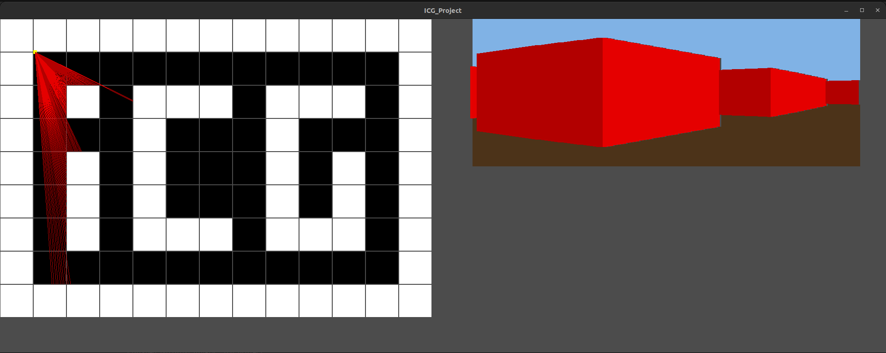

# UFPB_icg_project

Repositório para o projeto final da disciplina de Introdução à Computação Gráfica.

Este é um projeto de introdução à computação gráfica, onde implementamos um Ray Casting utilizando C++ e OpenGL.

## O que o código faz

O código implementa uma aplicação gráfica que utiliza técnicas de Ray Casting para simular a visualização de um ambiente 2D em uma representação 3D. A aplicação permite que o usuário se mova pelo ambiente e visualize as interseções de raios com paredes, teto e piso, criando uma representação realista de um espaço tridimensional.

## Imagem do programa

  <!-- Altere o caminho para a imagem do seu programa -->

## Estrutura do Projeto

root |- Makefile |- include |- (arquivos.hpp) |- src |- (arquivos.cpp)


## Requisitos

Antes de compilar, certifique-se de que as bibliotecas necessárias estão instaladas:

```bash
sudo apt update
sudo apt install freeglut3 freeglut3-dev
sudo apt install mesa-utils

## Compilação
make

##Execução
./icg_project